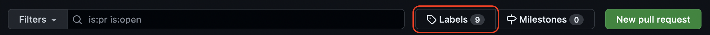
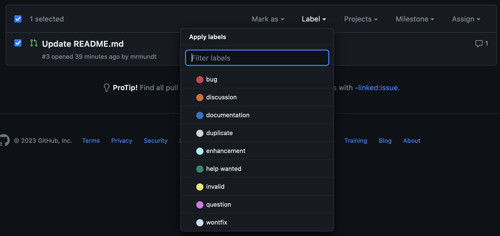
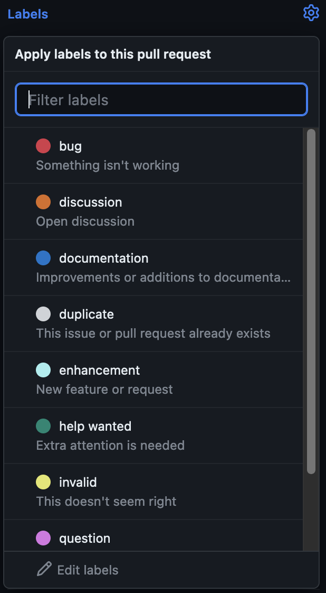
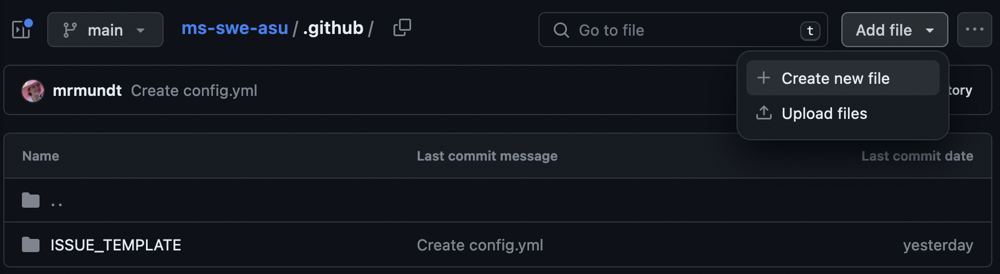
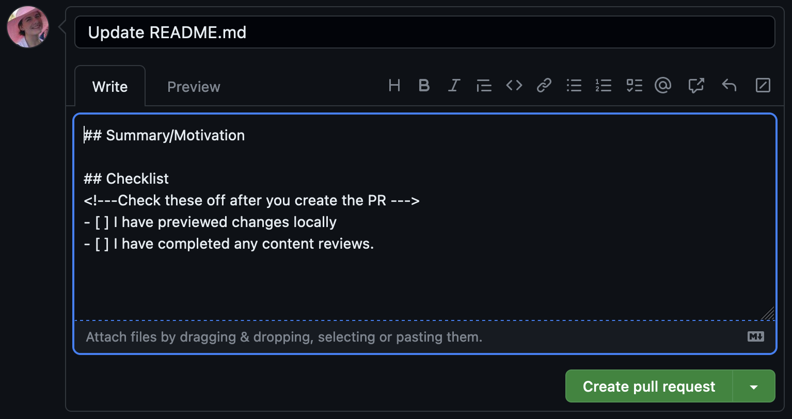

::::::::::::::::::::::::::::::::::::::: objectives

- "Learn how to use labels for GitHub PRs."
- "Learn how to create a PR template."

::::::::::::::::::::::::::::::::::::::::::::::::::

:::::::::::::::::::::::::::::::::::::::: questions

- "How do you assign labels to PRs?"
- "How do you create PR templates?"

::::::::::::::::::::::::::::::::::::::::::::::::::

## GitHub Labels

Each new GitHub repository comes with a set of default labels that can be
assigned to issues, pull requests, or discussions.

From [GitHub's official documentation](https://docs.github.com/en/issues/using-labels-and-milestones-to-track-work/managing-labels#about-default-labels):

| Label | Description |
| ----- | ----------- |
| `bug`   | Indicates an unexpected problem or unintended behavior |
| `documentation` | Indicates a need for improvements or additions to documentation |
| `duplicate` | Indicates similar issues, pull requests, or discussions |
| `enhancement` | Indicates new feature requests |
| `good first issue` | Indicates a good issue for first-time contributors |
| `help wanted` | Indicates that a maintainer wants help on an issue or pull request |
| `invalid` | Indicates that an issue, pull request, or discussion is no longer relevant |
| `question` | Indicates that an issue, pull request, or discussion needs more information |
| `wontfix` | Indicates that work won't continue on an issue, pull request, or discussion |

These labels can be viewed from the Issues and Pull Requests pages.

{alt='The PR page with the labels option highlighted'}

## Using Labels

Labels can be applied from the main Pull requests page or within a single PR.

From the main Pull requests page, simply checkmark the PR, hit the "Label"
dropdown, select your preferred label(s), and click outside of the
dropdown.

{alt='Apply Labels from the main PRs page'}

To apply within a single PR, click on the PR to open it. Then you
will see the "Labels" option on the right-hand side.

Click on "Labels". A dropdown will appear in which you can select or deselect
your preferred label(s).

{alt='Label dropdown within a single issue'}

:::::::::::::::::::::::::::::::::::::::  challenge

## Stick the Label

Navigate to your practice repository's PR page.
 
* Make another small change to your `README.md` and open a PR
* Add the `documentation` label

::::::::::::::::::::::::::::::::::::::::::::::::::

## What are PR Templates?

PR templates in GitHub are a way to pre-fill new PRs with specific
sections, data, instructions, etc.

They are customizable for every project. You can add as many templates as
makes sense for your project, or you can have none at all.

## Create a New PR Template

Unlike Issues, GitHub does not have a default template for PRs. Instead,
we must make the template from scratch.

We navigate to the main repository page. We can make the template in the root
of the repository; however, we recommend instead making it in the `.github`
directory.

:::::::::::::::::::::::::::::::::::::::::  callout

## The `.github` Directory

If you are completing this episode after doing the [Issue Tracking
lesson](http://intersect-training.org/Issue-Tracking), you
should already have a `.github` directory. If not, you'll need to make one!
Read more about it on [freeCodeCamp](https://www.freecodecamp.org/news/how-to-use-the-dot-github-repository/).

::::::::::::::::::::::::::::::::::::::::::::::::::

In the `.github` repository, we will add a new file named `PULL_REQUEST_TEMPLATE.md`.

{alt='Add a new file to the .github directory'}

You can now put whatever content you desire in the template. Some examples are:

- _Link to Issue_: If you want the submitter to link to relevant issues.
- _Summary_: A section for a description of the changes proposed
- _Checklists_: A checklist of steps to be completed before a PR can be reviewed.
- _Legal Acknowledgement_: A summary of legal information

Once the template has the preferred information, commit the changes to the `main`
branch.

:::::::::::::::::::::::::::::::::::::::  challenge

## Make that Template

Navigate to your practice repository's PR page. Create a PR Template that
includes:

* Description
* Checklist with two steps
* (CHALLENGE) Add a comment that does not render in Markdown to provide extra information for the submitter

::::::::::::::::::::::::::::::::::::::::::::::::::

Now when a new PR is opened, the "Write" section will autofill with our
template.

{alt='New PR with template'}

:::::::::::::::::::::::::::::::::::::::: keypoints

- "Labelling PRs can help with prioritization and organization."
- "PR Templates can provide clear instructions for steps, expectations, and more."

::::::::::::::::::::::::::::::::::::::::::::::::::
